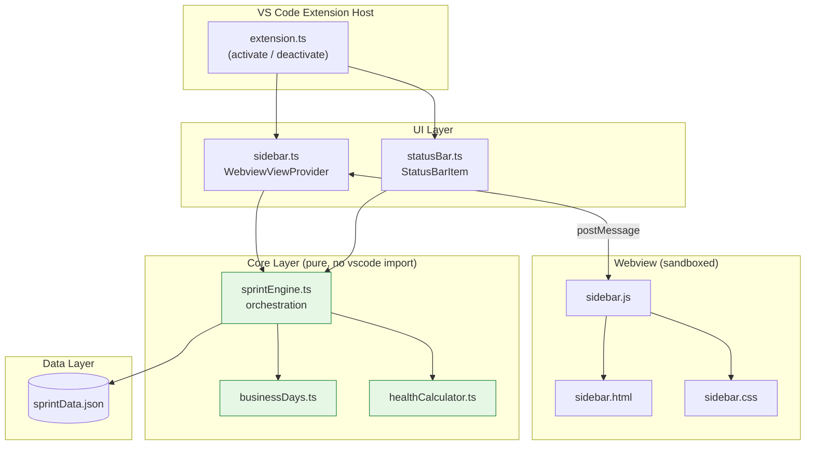
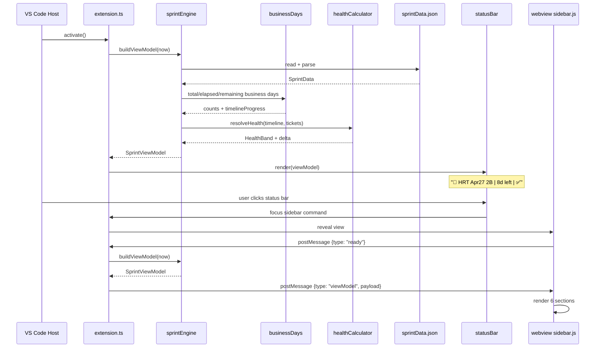
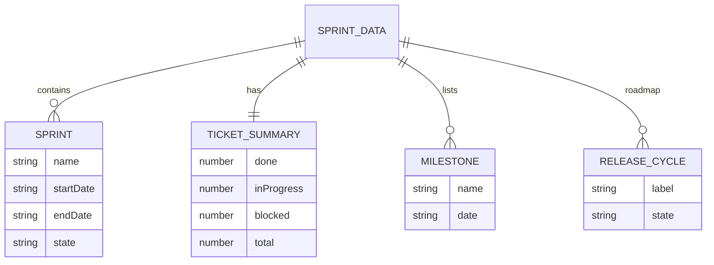
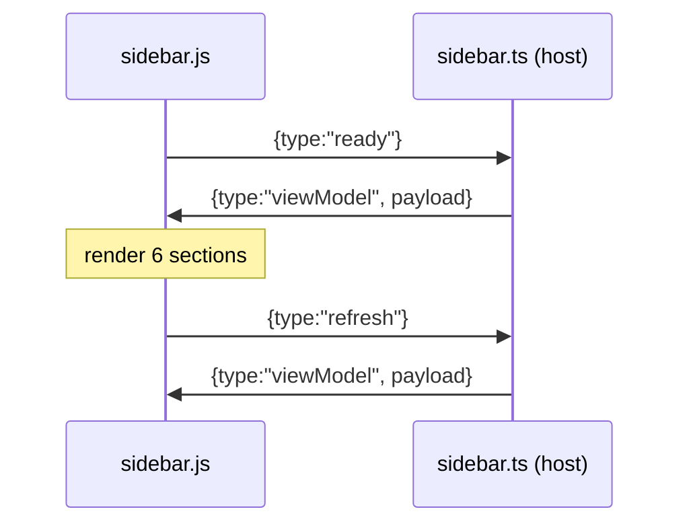

# Design Document: SprintPulse

## Overview

SprintPulse is a VS Code extension that shows a live sprint HUD inside the IDE. It answers, in about 3 seconds, the questions developers usually open Jira or Confluence for: what sprint am I in, how many business days are left, am I on track, what sprint comes next, and when are the release milestones.

The MVP reads a local JSON file (`storage/sprintData.json`). There is no Jira, Confluence, or network integration. A status bar widget shows a compact summary. Clicking it opens a webview sidebar with six sections: current sprint, ticket progress, sprint health, next sprint, release roadmap, and milestones.

All date math runs in Central Time (America/Chicago), because sprint calendars and release milestones are defined in that zone. Business day counts exclude Saturday and Sunday. Custom holidays are out of scope for the MVP but the design leaves a clean seam for them.

---

## Architecture

This section and the two that follow it (Components and Interfaces, Data Models) present the **high-level design**: the layered architecture, data flow, and the shapes that flow between layers.

The extension follows the layered VS Code extension pattern. The extension host activates, wires up the UI surfaces (status bar + webview), and delegates all computation to a pure core. The core reads from a JSON data store and never touches VS Code APIs, which keeps it unit-testable.



Green nodes are pure TypeScript modules with no `vscode` dependency. They take data in and return a view model out, so they can be tested with property-based tests directly.

### Data Flow

The status bar and sidebar are two views over the same computed view model. On activation, and on any data change, the engine reloads the JSON, computes the view model, and pushes it to both surfaces.



## Components and Interfaces

| Component | File | Depends on `vscode`? | Responsibility |
|-----------|------|----------------------|----------------|
| Extension entry | `src/extension.ts` | Yes | Activate/deactivate, register command + views, watch JSON file, push view model to both surfaces |
| Status bar | `src/statusBar.ts` | Yes | Own the `StatusBarItem`, render compact summary, route click to the sidebar command |
| Sidebar | `src/sidebar.ts` | Yes | `WebviewViewProvider`, load webview assets, run the messaging protocol |
| Sprint engine | `core/sprintEngine.ts` | No | Load data, pick active + next sprint, call calculators, assemble `SprintViewModel` |
| Business days | `core/businessDays.ts` | No | Total / elapsed / remaining business days in Central Time, timeline progress |
| Health calculator | `core/healthCalculator.ts` | No | Delta and health band resolution |
| Webview script | `webview/sidebar.js` | No (runs in webview) | Receive view model, render sections, request refresh |

## Data Models

This section holds the full data model: the entity relationships (ER diagram) and the concrete interfaces/types the code uses. The types were originally part of the low-level design and are grouped here so the data model lives in one place.

### Entity Relationships (ER Diagram)



### Core Interfaces / Types

```typescript
// models/sprint.ts
export type SprintState = "active" | "future" | "closed";

export interface Sprint {
  name: string;         // e.g. "HRT Apr27 2B"
  startDate: string;    // ISO date "YYYY-MM-DD", interpreted in America/Chicago
  endDate: string;      // ISO date "YYYY-MM-DD", inclusive last day
  state: SprintState;
}

// models/ticketSummary.ts
export interface TicketSummary {
  done: number;
  inProgress: number;
  blocked: number;
  total: number;
}

// models/milestone.ts
export interface Milestone {
  name: string;         // e.g. "Branching"
  date: string;         // ISO date "YYYY-MM-DD" in America/Chicago
}

// models/releaseCycle.ts
export type CycleState = "completed" | "current" | "upcoming";

export interface ReleaseCycle {
  label: string;        // e.g. "2B"
  state: CycleState;    // completed | current | upcoming
}

// The full data store parsed from storage/sprintData.json
export interface SprintData {
  sprints: Sprint[];
  ticketSummary: TicketSummary;
  milestones: Milestone[];
  releaseRoadmap: ReleaseCycle[];
}
```

The view model is what both UI surfaces render. The engine produces it; the UI never recomputes.

```typescript
// core/sprintEngine.ts (view model)
export type HealthBand = "ahead" | "onTrack" | "behind" | "atRisk";

export interface TimelineView {
  totalBusinessDays: number;
  elapsedBusinessDays: number;
  remainingBusinessDays: number;
  timelineProgress: number;   // in [0, 1]
}

export interface TicketView {
  done: number;
  inProgress: number;
  blocked: number;
  total: number;
  ticketProgress: number;     // in [0, 1]; 0 when total === 0
}

export interface HealthView {
  band: HealthBand;
  delta: number;              // ticketProgress - timelineProgress, in [-1, 1]
  color: "green" | "yellow" | "red";
  label: string;              // "On Track", "Behind Schedule", ...
}

export interface SprintViewModel {
  currentSprint: Sprint | null;
  timeline: TimelineView | null;   // null when no active sprint
  tickets: TicketView;
  health: HealthView | null;       // null when no active sprint
  nextSprint: Sprint | null;
  roadmap: ReleaseCycle[];
  milestones: Milestone[];         // upcoming only, sorted ascending by date
  statusBarText: string;           // e.g. "🏃 HRT Apr27 2B | 8d left | ✅"
}
```

## Low-Level Design

This section covers the **low-level design**: timezone handling, function signatures, algorithms, the messaging protocol, and the JSON schema.

### Timezone Handling

All "today" and date-difference math is evaluated in America/Chicago. A single helper converts a moment into a Central-Time calendar date, so no calculation depends on the machine's local zone.

```typescript
// core/businessDays.ts

/** A timezone-independent calendar date (no time-of-day). */
export interface CalendarDate {
  year: number;
  month: number;  // 1-12
  day: number;    // 1-31
}

/**
 * Convert an instant to the calendar date it falls on in America/Chicago.
 * Implemented with Intl.DateTimeFormat({ timeZone: "America/Chicago" }) so it
 * is correct across DST transitions.
 */
export function toCentralDate(instant: Date): CalendarDate;

/** Parse an ISO "YYYY-MM-DD" string into a CalendarDate (no zone conversion). */
export function parseIsoDate(iso: string): CalendarDate;

/** Compare two calendar dates: -1, 0, or 1. */
export function compareDates(a: CalendarDate, b: CalendarDate): number;

/** True if the date is Saturday or Sunday (weekday computed zone-free). */
export function isWeekend(date: CalendarDate): boolean;
```

### Business Days: Function Signatures

```typescript
// core/businessDays.ts

/**
 * Count business days (Mon-Fri) in [start, end] inclusive of both endpoints.
 * Returns 0 if end < start.
 */
export function countBusinessDays(start: CalendarDate, end: CalendarDate): number;

/** Total business days in the sprint, inclusive of start and end. */
export function totalBusinessDays(sprint: Sprint): number;

/**
 * Business days already elapsed as of `today`, clamped to [0, total].
 * A day counts as elapsed once it has started (today is counted if today is a
 * business day within the sprint).
 */
export function elapsedBusinessDays(sprint: Sprint, today: CalendarDate): number;

/** remaining = total - elapsed, clamped to [0, total]. */
export function remainingBusinessDays(sprint: Sprint, today: CalendarDate): number;

/** timelineProgress = elapsed / total, in [0, 1]; returns 0 when total === 0. */
export function timelineProgress(sprint: Sprint, today: CalendarDate): number;
```

### Business Days: Algorithm

```pascal
ALGORITHM countBusinessDays(start, end)
INPUT: start, end (CalendarDate)
OUTPUT: count (integer >= 0)

BEGIN
  IF compareDates(end, start) < 0 THEN
    RETURN 0
  END IF

  count   ← 0
  cursor  ← start

  WHILE compareDates(cursor, end) <= 0 DO
    // INVARIANT: count = number of business days in [start, previous cursor]
    IF NOT isWeekend(cursor) THEN
      count ← count + 1
    END IF
    cursor ← nextCalendarDay(cursor)   // pure calendar increment, no timezone
  END WHILE

  RETURN count
END
```

```pascal
ALGORITHM elapsedBusinessDays(sprint, today)
INPUT: sprint, today (CalendarDate)
OUTPUT: elapsed (integer in [0, total])

BEGIN
  total ← totalBusinessDays(sprint)

  IF compareDates(today, sprint.startDate) < 0 THEN
    RETURN 0                         // sprint has not started
  END IF
  IF compareDates(today, sprint.endDate) >= 0 THEN
    RETURN total                     // sprint is over (or on last day boundary)
  END IF

  // today is strictly inside the sprint window
  elapsed ← countBusinessDays(sprint.startDate, today)
  RETURN clamp(elapsed, 0, total)
END
```

**Preconditions**
- `sprint.startDate` and `sprint.endDate` are valid ISO dates.
- `today` is a valid `CalendarDate`.

**Postconditions**
- `0 <= elapsed <= total`.
- `remaining = total - elapsed`, so `0 <= remaining <= total`.
- Before the sprint starts, `elapsed = 0`. On/after the end date, `elapsed = total`.

**Loop invariant (countBusinessDays)**
- At the top of each iteration, `count` equals the number of business days in `[start, cursor - 1 day]`.

### Health Calculator: Function Signatures

```typescript
// core/healthCalculator.ts

/** delta = ticketProgress - timelineProgress, both in [0,1] → delta in [-1, 1]. */
export function healthDelta(ticketProgress: number, timelineProgress: number): number;

/** Resolve the health band from a delta using the fixed threshold ladder. */
export function resolveHealthBand(delta: number): HealthBand;

/** Full health view: band + delta + color + human label. */
export function resolveHealth(ticketProgress: number, timelineProgress: number): HealthView;
```

### Health Bands: Resolving the Threshold Overlap

The brief lists overlapping thresholds (`<= -10%` behind and `<= -25%` at risk). These are resolved into four **disjoint, exhaustive, ordered** bands over `delta`. The `atRisk` band is the most severe slice of the "behind" region and is checked first.

| Band | Condition on `delta` | Color | Label |
|------|----------------------|-------|-------|
| At Risk | `delta <= -0.25` | red | "At Risk" |
| Behind Schedule | `-0.25 < delta <= -0.10` | yellow | "Behind Schedule" |
| On Track | `-0.10 < delta < 0.10` | green | "On Track" |
| Ahead Schedule | `delta >= 0.10` | green | "Ahead of Schedule" |

Boundary rule: a value exactly on a negative threshold takes the more severe band (`-0.25` → At Risk, `-0.10` → Behind). `+0.10` → Ahead. This makes every real number map to exactly one band.

```pascal
ALGORITHM resolveHealthBand(delta)
INPUT: delta (real in [-1, 1])
OUTPUT: band (HealthBand)

BEGIN
  IF delta <= -0.25 THEN
    RETURN "atRisk"
  ELSE IF delta <= -0.10 THEN
    RETURN "behind"
  ELSE IF delta < 0.10 THEN
    RETURN "onTrack"
  ELSE
    RETURN "ahead"          // delta >= 0.10
  END IF
END
```

Band → color / label mapping:

| Band | Color | Label |
|------|-------|-------|
| `ahead` | green | "Ahead of Schedule" |
| `onTrack` | green | "On Track" |
| `behind` | yellow | "Behind Schedule" |
| `atRisk` | red | "At Risk" |

### Sprint Engine: Orchestration

```typescript
// core/sprintEngine.ts

/** Load and validate the JSON data store. Throws on malformed data. */
export function loadSprintData(raw: string): SprintData;

/** Pick the active sprint: state === "active", else the one whose window contains today. */
export function pickActiveSprint(data: SprintData, today: CalendarDate): Sprint | null;

/** Next sprint = earliest sprint whose startDate is on/after the active sprint's endDate. */
export function pickNextSprint(data: SprintData, active: Sprint | null): Sprint | null;

/** Upcoming milestones = milestones with date >= today, sorted ascending. */
export function upcomingMilestones(data: SprintData, today: CalendarDate): Milestone[];

/** Compose everything into the view model both UI surfaces render. */
export function buildViewModel(data: SprintData, now: Date): SprintViewModel;
```

```pascal
ALGORITHM buildViewModel(data, now)
INPUT: data (SprintData), now (Date)
OUTPUT: vm (SprintViewModel)

BEGIN
  today   ← toCentralDate(now)
  active  ← pickActiveSprint(data, today)

  tickets ← buildTicketView(data.ticketSummary)   // ticketProgress = done/total, 0 if total=0

  IF active = NULL THEN
    timeline ← NULL
    health   ← NULL
    statusBar ← "🏃 No active sprint"
  ELSE
    total     ← totalBusinessDays(active)
    elapsed   ← elapsedBusinessDays(active, today)
    remaining ← remainingBusinessDays(active, today)
    tlProg    ← timelineProgress(active, today)
    timeline  ← { total, elapsed, remaining, tlProg }
    health    ← resolveHealth(tickets.ticketProgress, tlProg)
    statusBar ← format("🏃 {name} | {remaining}d left | {healthIcon}", active, remaining, health)
  END IF

  vm ← {
    currentSprint: active,
    timeline,
    tickets,
    health,
    nextSprint:  pickNextSprint(data, active),
    roadmap:     data.releaseRoadmap,
    milestones:  upcomingMilestones(data, today),
    statusBarText: statusBar
  }
  RETURN vm
END
```

### Status Bar Rendering

```typescript
// src/statusBar.ts
export function renderStatusBar(item: vscode.StatusBarItem, vm: SprintViewModel): void;
```

The health icon maps from the band: `ahead`/`onTrack` → `✅`, `behind` → `⚠`, `atRisk` → `🔴`. Example output: `🏃 HRT Apr27 2B | 8d left | ✅`. The item's command is `sprintpulse.openSidebar`, so a click reveals the webview.

### Webview Messaging Protocol

The extension host and `sidebar.js` communicate only through `postMessage`. Messages are typed and versioned lightly so future fields do not break older webviews.

```typescript
// Extension host → webview
type HostToWebview =
  | { type: "viewModel"; payload: SprintViewModel };

// Webview → extension host
type WebviewToHost =
  | { type: "ready" }        // webview finished loading, request first render
  | { type: "refresh" };     // user clicked a refresh affordance
```



The webview renders the six sections from a single `viewModel` payload: current sprint (with progress bar from `timelineProgress`), ticket progress (bar from `ticketProgress`), health (color from `health.color`), next sprint, roadmap (✓ / ► / plain from `state`), and upcoming milestones.

### JSON Schema for `sprintData.json`

The MVP example is extended to cover milestones and the release roadmap.

```json
{
  "sprints": [
    { "name": "HRT Apr27 2A", "startDate": "2026-09-11", "endDate": "2026-09-25", "state": "closed" },
    { "name": "HRT Apr27 2B", "startDate": "2026-09-25", "endDate": "2026-10-09", "state": "active" },
    { "name": "HRT Apr27 3A", "startDate": "2026-10-09", "endDate": "2026-10-23", "state": "future" }
  ],
  "ticketSummary": { "done": 15, "inProgress": 3, "blocked": 2, "total": 20 },
  "milestones": [
    { "name": "Branching",      "date": "2026-10-08" },
    { "name": "1st Preprod",    "date": "2026-11-04" },
    { "name": "2nd Preprod",    "date": "2026-11-26" },
    { "name": "Feature Cutoff", "date": "2027-01-22" }
  ],
  "releaseRoadmap": [
    { "label": "1A", "state": "completed" },
    { "label": "1B", "state": "completed" },
    { "label": "2A", "state": "completed" },
    { "label": "2B", "state": "current" },
    { "label": "3A", "state": "upcoming" },
    { "label": "3B", "state": "upcoming" }
  ]
}
```

**Validation rules (enforced in `loadSprintData`)**
- Every `startDate` / `endDate` / milestone `date` matches `^\d{4}-\d{2}-\d{2}$`.
- Each sprint has `endDate >= startDate`.
- At most one sprint has `state === "active"`.
- `ticketSummary`: all counts `>= 0`; `total >= done + inProgress + blocked` is expected but not required (blocked/in-progress may overlap categories in future data).
- At most one release cycle has `state === "current"`.

### Extensibility Seam: Holidays

`countBusinessDays` treats a day as a business day when `NOT isWeekend(date)`. A future holiday feature swaps this for `NOT isWeekend(date) AND NOT isHoliday(date)` by passing an optional `holidays: CalendarDate[]` set. No caller signature changes because the predicate is internal. This is noted here only; it is out of MVP scope.

---

## Error Handling

All failure modes resolve to a safe, rendered state. The extension never crashes the host and never shows a blank sidebar; a degraded but honest view is always preferable to an exception.

| Failure | Where detected | Handling | User-visible result |
|---------|----------------|----------|---------------------|
| Malformed JSON (parse error) | `loadSprintData` | Catch the `JSON.parse` throw, wrap in a typed `SprintDataError` | Status bar shows `🏃 Sprint data unreadable`; sidebar shows an error card with the parse message |
| Missing JSON file | `extension.ts` file read | Detect ENOENT before parsing | Status bar shows `🏃 No sprint data`; sidebar prompts to create `storage/sprintData.json` |
| Missing required fields | `loadSprintData` validation | Reject when `sprints`, `ticketSummary`, `milestones`, or `releaseRoadmap` is absent | Same error card path as malformed JSON, naming the missing field |
| Invalid date format | `loadSprintData` validation | Reject any date failing `^\d{4}-\d{2}-\d{2}$`; also reject `endDate < startDate` | Error card names the offending sprint/milestone and value |
| No active sprint | `pickActiveSprint` returns `null` | Not an error — a valid state | `timeline`/`health` are `null`; status bar shows `🏃 No active sprint`; sidebar hides sprint/health sections |
| Division by zero (timeline) | `timelineProgress` | Guard: `total === 0` → return `0` | Progress bar shows 0%, no NaN |
| Division by zero (tickets) | `buildTicketView` | Guard: `total === 0` → `ticketProgress = 0` | Progress bar shows 0%, no NaN |
| Webview messaging failure | `sidebar.ts` host | `postMessage` wrapped in try/catch; a dropped `ready` handshake is retried on next reveal | Sidebar re-requests the view model on next open; no stuck empty panel |
| More than one `active` sprint | `loadSprintData` validation | Reject per the "at most one active" rule | Error card explains the ambiguous state |

**Principles**
- Validation lives in `loadSprintData`, so the pure core downstream can assume well-formed data.
- Errors are returned/thrown as typed values, not swallowed silently, so tests can assert on them.
- Division guards are also encoded as correctness properties (9 and 11 below).

---

## Correctness Properties

These are written for property-based testing (e.g., fast-check). `today`, `start`, and `end` are arbitrary `CalendarDate` values; progresses are arbitrary reals in `[0, 1]`. Properties 1-7 cover **business days**, 8-9 **timeline progress**, 10-11 **ticket progress**, 12-15 **health band**, 16-17 **timezone stability**, and 18-20 **view model consistency**.

### Property 1: Business days are non-negative

For all `start, end`: `countBusinessDays(start, end) >= 0`.

**Validates: Requirements 8.3**

### Property 2: Business days bounded by span

`countBusinessDays(start, end) <= totalCalendarDays(start, end)` (business days never exceed calendar days in the inclusive range).

**Validates: Requirements 8.3**

### Property 3: Empty when reversed

If `end < start` then `countBusinessDays(start, end) === 0`.

**Validates: Requirements 8.5**

### Property 4: Elapsed within total

For all `sprint, today`: `0 <= elapsedBusinessDays(sprint, today) <= totalBusinessDays(sprint)`.

**Validates: Requirements 9.1**

### Property 5: Elapsed + remaining = total

`elapsedBusinessDays(s, t) + remainingBusinessDays(s, t) === totalBusinessDays(s)`.

**Validates: Requirements 9.2, 9.3**

### Property 6: Elapsed is monotone in time

If `t1 <= t2` then `elapsedBusinessDays(s, t1) <= elapsedBusinessDays(s, t2)` (elapsed never decreases as today advances).

**Validates: Requirements 9.4**

### Property 7: Boundary behavior

Before start → `elapsed = 0`; on/after end → `elapsed = total`.

**Validates: Requirements 9.5, 9.6**

### Property 8: Timeline progress in range

For all `sprint, today`: `0 <= timelineProgress(sprint, today) <= 1`.

**Validates: Requirements 10.2**

### Property 9: Timeline progress zero-total safe

If `totalBusinessDays(sprint) === 0` then `timelineProgress === 0` (no division by zero).

**Validates: Requirements 9.7, 10.3**

### Property 10: Ticket progress in range

`0 <= ticketProgress <= 1`.

**Validates: Requirements 11.2**

### Property 11: Ticket progress zero-total safe

If `total === 0` then `ticketProgress === 0`.

**Validates: Requirements 11.3**

### Property 12: Health band is a total function

For every real `delta in [-1, 1]`, `resolveHealthBand(delta)` returns exactly one of the four bands (exhaustive, disjoint).

**Validates: Requirements 4.6**

### Property 13: Delta range

`healthDelta(tp, tl) in [-1, 1]` for `tp, tl in [0, 1]`.

**Validates: Requirements 12.1**

### Property 14: Monotone severity

If `delta1 <= delta2` then `severity(resolveHealthBand(delta1)) >= severity(resolveHealthBand(delta2))`, where severity order is `atRisk > behind > onTrack > ahead`. Lower delta is never healthier.

**Validates: Requirements 12.2**

### Property 15: Threshold placement

`resolveHealthBand(-0.25) === "atRisk"`, `resolveHealthBand(-0.10) === "behind"`, `resolveHealthBand(0.10) === "ahead"`, `resolveHealthBand(0) === "onTrack"`.

**Validates: Requirements 4.2, 4.3, 4.4, 4.5, 12.3, 12.4, 12.5, 12.6**

### Property 16: Zone-stable date math

For a fixed instant `now`, `toCentralDate(now)` and every downstream count are independent of the host machine's local timezone (same result under any `TZ` env).

**Validates: Requirements 13.1, 13.2**

### Property 17: DST-safe day count

Business day counts across a US DST transition (spring forward / fall back) equal the count computed on plain calendar dates — no day is dropped or double-counted.

**Validates: Requirements 13.3**

### Property 18: No active sprint yields null views

If `pickActiveSprint` returns `null`, then `timeline === null` and `health === null`, and `statusBarText` reflects the no-sprint state.

**Validates: Requirements 16.3**

### Property 19: Next sprint follows current

If both exist, `nextSprint.startDate >= currentSprint.endDate`.

**Validates: Requirements 5.1**

### Property 20: Milestones are upcoming and sorted

Every milestone in `vm.milestones` has `date >= today`, and the list is ascending by date.

**Validates: Requirements 7.1, 7.2**

---

## Testing Strategy

**Unit tests** cover the pure core: `businessDays`, `healthCalculator`, and `sprintEngine` selection logic (active/next sprint, milestone filtering, malformed-JSON rejection). These need no VS Code host.

**Property-based tests** (fast-check) encode the properties above. Priorities: business-day invariants (1-7), progress ranges (8-11), health totality and monotonicity (12-15), and timezone stability (16-17) by running the suite under multiple `TZ` values.

**Property Test Library**: fast-check (TypeScript).

**Integration tests** use `@vscode/test-electron` to assert the extension activates, registers the `sprintpulse.openSidebar` command, renders status bar text, and completes the `ready → viewModel` webview handshake.

---

## Dependencies

| Dependency | Purpose |
|-----------|---------|
| `vscode` engine API | Status bar, webview view, commands, file watcher |
| TypeScript | Language for extension + core |
| `fast-check` (dev) | Property-based testing |
| `@vscode/test-electron` (dev) | Integration tests in a VS Code host |
| `Intl.DateTimeFormat` (built-in) | Central-Time date conversion, no extra library |

No runtime database or network dependency in the MVP.

---

## Out of Scope (MVP) and Future Enhancements

Out of scope: AI features, Jira/Confluence/Teams/GitLab integration, story points, burndown charts, notifications, historical analytics, custom holidays.

Future: auto-import sprints from Jira, milestones from Confluence, story point tracking, burndown charts, sprint history, Teams notifications, and the custom-holiday seam described above.
